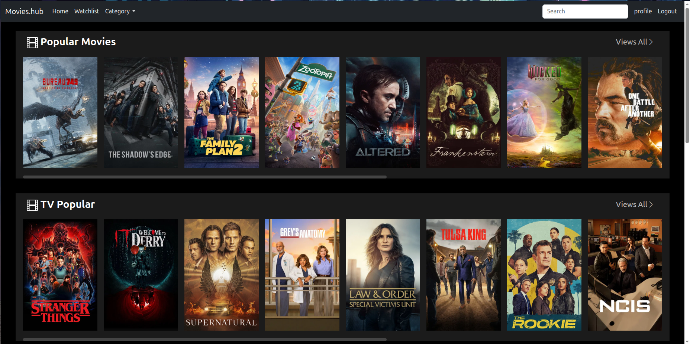
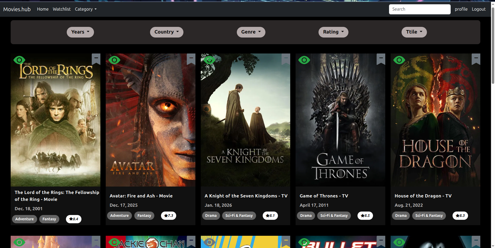
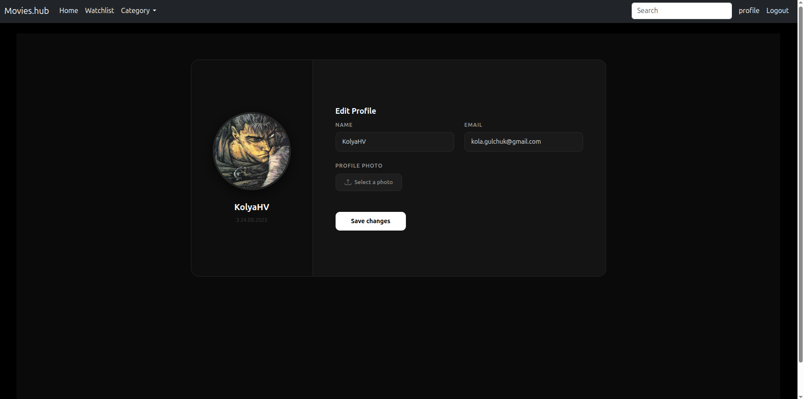
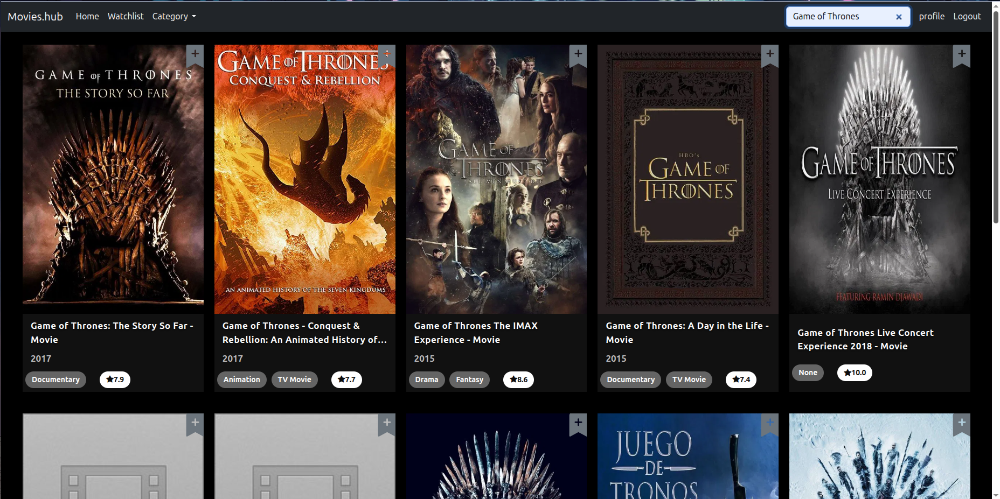
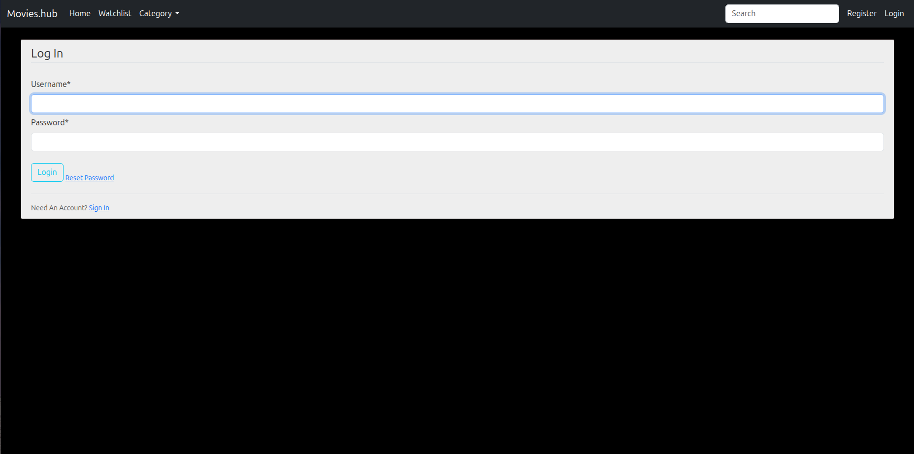
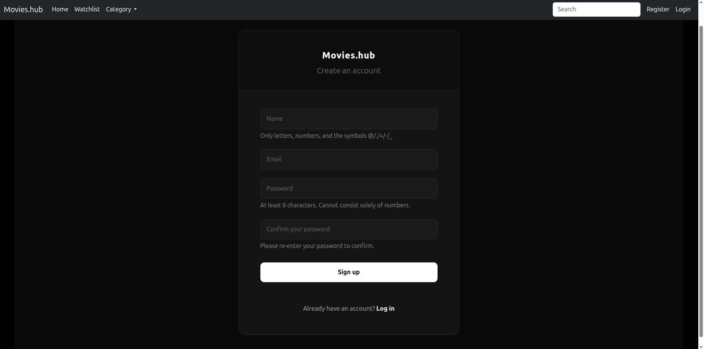

# My Django Movie app

## Project Description (English)
This web application allows users to search for movies and TV shows using the TMDB API, add them to a personal watchlist, and view detailed information such as genres, ratings, and release dates.  
It is built with Django, Bootstrap, and Sqlit3, and demonstrates clean architecture and user-friendly design.

## Features
- Search movies and TV shows
- Add items to a personal watchlist
- Pagination for results
- User authentication (register/login)
- Display genres, ratings, and release dates
- password reset
- user profile

## Screenshots
## Homepage


## Watchlist


## Profile


## Search


## Loginpage


## Register



## Technologies used
- Django
- Django OR
- Django Rest Framework
- TMDB API
- Bootstrap
- SQLite3
- HTML
- CSS
- Git


## Installation
1. Clone the repository:
``` bash
git clone https://github.com/KolyaHulchuk/film_project_django.git 

2. Install dependencies:
pip install -r requirements.txt

3. Perform migrations:
python manage.py migrate

4. Start the server:
python manage.py runserver
```


# Мій  Django сайт фільмів

## Опис проекту (Українська)
Ця веб-програма дозволяє користувачам шукати фільми та телевізійні шоу за допомогою API TMDB, додавати їх до особистого списку для перегляду та переглядати детальну інформацію, таку як жанри, рейтинги та дати виходу.  
Вона створена за допомогою Django, Bootstrap та Sqlit3 і демонструє чітку архітектуру та зручний дизайн.

## Функції
- Пошук фільмів та телешоу
- Додавання елементів до особистого списку для перегляду
- Пагінація результатів
- Аутентифікація користувачів (реєстрація/вхід)
- Відображення жанрів, рейтингів та дат виходу
- Скидання пароля
- Профіль користувача


## Скріншоти
## Домашня сторінка


## Список перегляду


## Профіль


## Пошук


## Вхід


## Регістрація


## Використані технології
- Django
- Django OR
- Django Rest Framework
- TMDB API
- Bootstrap
- SQLite3
- HTML
- CSS
- Git


## Встановлення
1. Клонування репозиторію:
``` bash
git clone https://github.com/KolyaHulchuk/film_project_django.git 

2. Встановлення залежностей:
pip install -r requirements.txt

3. Виконати міграції:
python manage.py migrate

4. Запустити сервер:
python manage.py runserver
