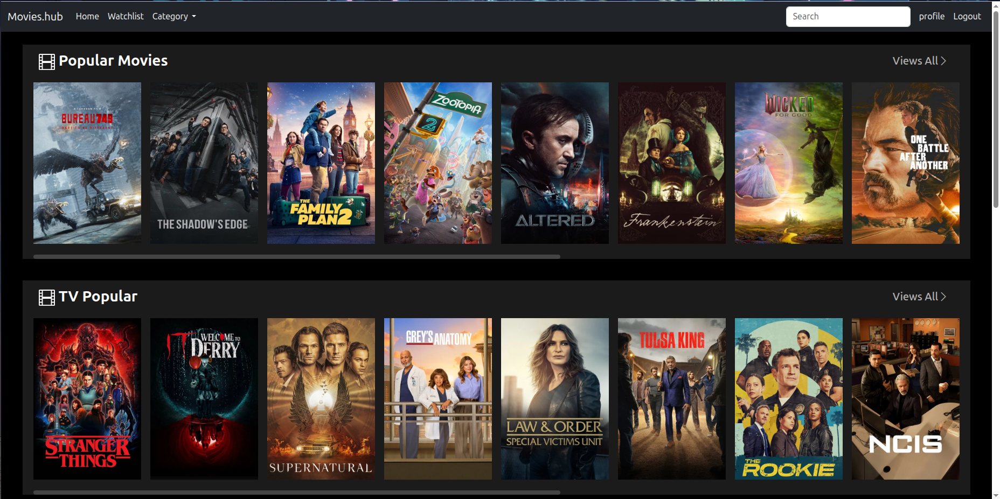
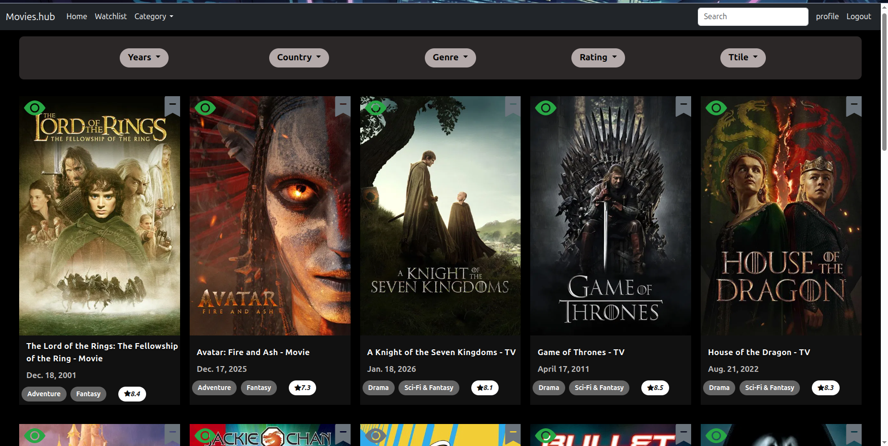
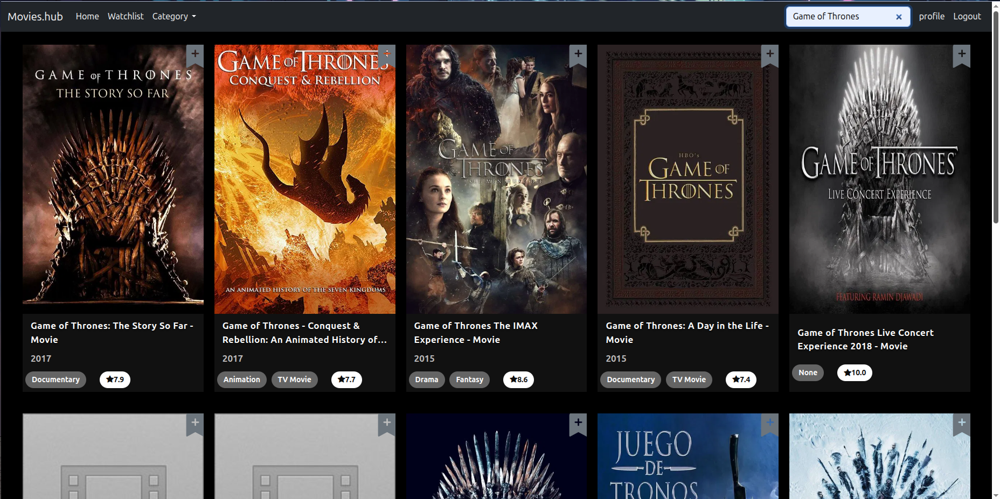
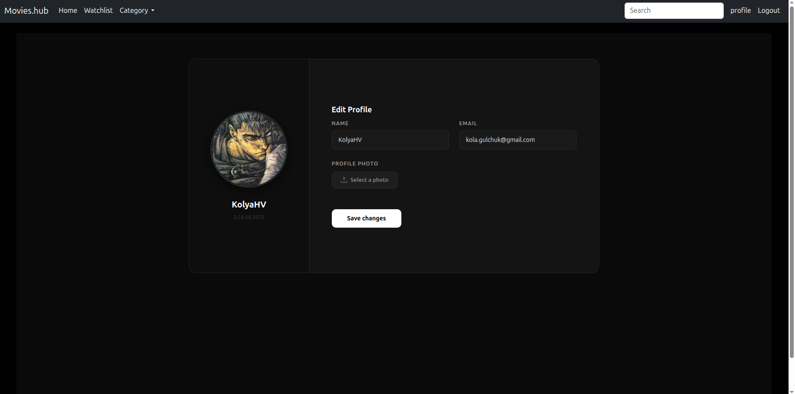
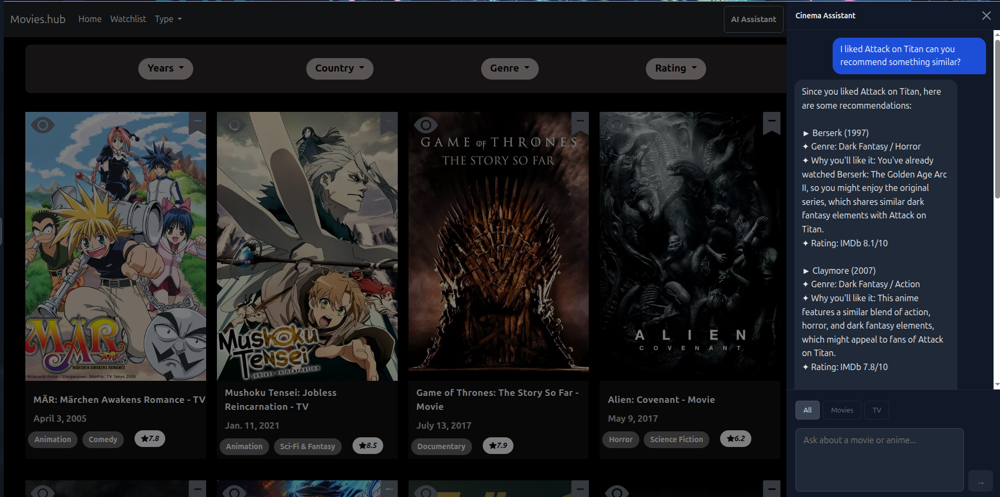
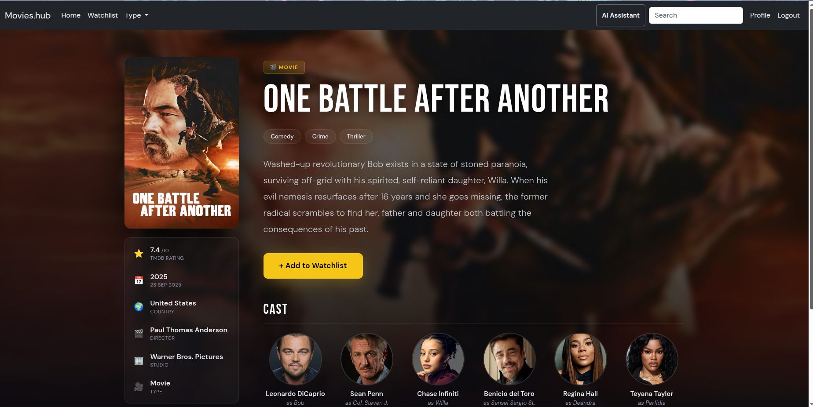
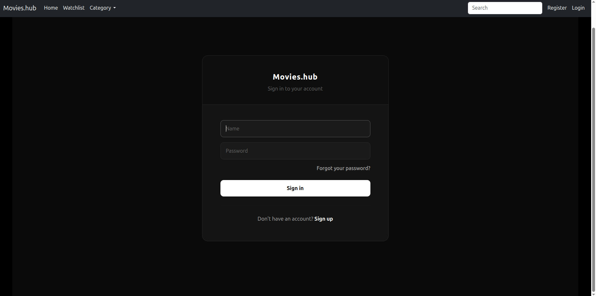
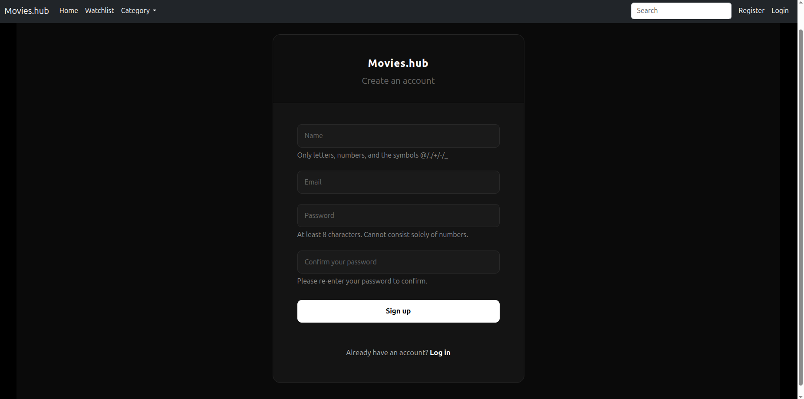

# 🎬 Django Movie App

A full-stack web application for discovering movies and TV shows using the TMDB API. Users can search, filter, manage a personal watchlist — all backed by a documented REST API with JWT authentication.

---

## Features

-  Search movies and TV shows
-  Browse by category: Popular, Top Rated, Now Playing, Upcoming, Anime, Doramas
-  Filter by genre, year, rating, and country
-  Watchlist — add films, mark as watched/unwatched
-  Pagination for results
-  User profile with avatar upload and password reset
-  Authentication — register, login, JWT-based API access
-  REST API — full CRUD endpoints with JWT auth, tested in Postman

---

## REST API

**Base URL:** `http://127.0.0.1:8000/api/`

### Authentication

| Method | Endpoint | Auth | Description |
|--------|----------|------|-------------|
| POST | `/api/token/` | ❌ | Get JWT access + refresh tokens |
| POST | `/api/token/refresh/` | ❌ | Refresh access token |

### Movies

| Method | Endpoint | Auth | Description |
|--------|----------|------|-------------|
| GET | `/api/movies/` | ❌ | List all movies (filter: `?genre=Action`) |
| GET | `/api/movies/{id}/` | ❌ | Movie details |
| GET | `/api/genres/` | ❌ | List all genres |

### User Data

| Method | Endpoint | Auth | Description |
|--------|----------|------|-------------|
| GET | `/api/ratings/` | ✅ | My ratings |
| POST | `/api/ratings/` | ✅ | Rate a movie |
| GET | `/api/watchlist/` | ✅ | My watchlist |
| POST | `/api/watchlist/` | ✅ | Add movie to watchlist |
| PUT | `/api/watchlist/{id}/` | ✅ | Update (mark as watched) |
| DELETE | `/api/watchlist/{id}/` | ✅ | Remove from watchlist |
| GET | `/api/profile/` | ✅ | My profile |
| PUT | `/api/profile/` | ✅ | Update profile |

---

## Examples

**Get JWT token:**
```bash
curl -X POST http://127.0.0.1:8000/api/token/ \
  -H "Content-Type: application/json" \
  -d '{"username": "your_username", "password": "your_password"}'
```

**Authenticated request:**
```bash
curl http://127.0.0.1:8000/api/watchlist/ \
  -H "Authorization: Bearer <your_access_token>"
```

---

## Tech Stack

| Category | Technology |
|----------|------------|
| Backend | Django 5, Django ORM |
| REST API | Django REST Framework |
| Auth | JWT (djangorestframework-simplejwt) |
| Frontend | HTML, CSS, HTMX, Bootstrap |
| Database | SQLite3 |
| External API | TMDB API |
| API Testing | Postman |
| Version Control | Git |

---

## Installation

```bash
# 1. Clone the repository
git clone https://github.com/KolyaHulchuk/film_project_django.git
cd film_project_django

# 2. Create and activate virtual environment
python -m venv venv
source venv/bin/activate  # Linux/Mac
venv\Scripts\activate     # Windows

# 3. Install dependencies
pip install -r requirements.txt

# 4. Set up environment variables
cp .env.example .env
# Edit .env and add your TMDB_API_KEY and SECRET_KEY

# 5. Run migrations
python manage.py migrate

# 6. Create superuser (optional)
python manage.py createsuperuser

# 7. Start the server
python manage.py runserver
```

---

## Screenshots

| Homepage | Watchlist |
|----------|-----------|
|  |  |

| Profile | Search |
|---------|--------|
|  |  |

| AI assistant| Movie Detail |
|-------------|--------|
|  |  |

| Login | Register |
|-------|----------|
|  |  |

---

## Project Structure

```
film_project_django/
├── api/                  # REST API (serializers, views, urls)
│   ├── serializers.py
│   ├── views.py
│   └── urls.py
├── movies/               # Movies app (models, views, TMDB client)
│   ├── models.py
│   ├── views.py
│   └── tmdb_service.py
├── users/                # Users app (profile, watchlist)
│   ├── models.py
│   └── views.py
├── templates/            # HTML templates
├── static/               # CSS, JS, images
└── manage.py
```

---

## Environment Variables

Create a `.env` file in the root directory:

```env
SECRET_KEY=your_django_secret_key
TMDB_API_KEY=your_tmdb_api_key
DEBUG=True
```